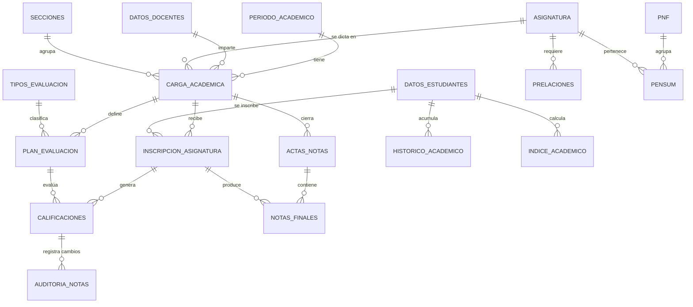
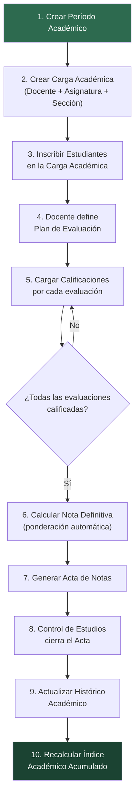

# Sistema Académico de Notas – UNEXCA (SIC)

## Análisis del Código Actual

He leído toda tu base de código. Tienes un proyecto en **PHP + PostgreSQL** con la siguiente estructura:

```
sic/
├── config/
│   ├── admin.sql          ← Schema admin (roles, usuarios, pagos)
│   ├── administracion.sql ← Schema unexca (todo el modelo académico + seeders)
│   └── unexca.sql         ← Schema unexca (versión limpia parcial)
├── models/                ← Vacío
├── seeders/
│   ├── sedes_unexca.php   ← Seeder de sedes
│   ├── trayectos.php      ← Seeder de trayectos
│   ├── turnos.php         ← Seeder de PNF (nombre incorrecto)
│   └── aulas.php          ← Seeder de aulas (tiene un bug)
├── init.php               ← Conexión PDO a PostgreSQL
└── README.md              ← Vacío
```

---

## Problemas Detectados en el Código Actual

> [!CAUTION]
> ### Errores Críticos que deben corregirse antes de avanzar

| # | Archivo | Problema | Detalle |
|---|---------|----------|---------|
| 1 | [administracion.sql](file:///c:/xampp/htdocs/sic/config/administracion.sql#L122-L132) | **Referencia circular** | `usuarios` referencia `datos_personas` pero `datos_personas` se crea después (línea 134) |
| 2 | [administracion.sql](file:///c:/xampp/htdocs/sic/config/administracion.sql#L128) | **Tabla inexistente** | `usuarios.id_tipo` referencia `unexca.tipos_usuario(id_tipo)` pero esa tabla nunca se crea |
| 3 | [administracion.sql](file:///c:/xampp/htdocs/sic/config/administracion.sql#L150-L155) | **Tabla duplicada** | `admin.roles` se crea 2 veces (línea 1 y línea 150), y la segunda usa `id_tipo_usuario` en PK que no existe como columna |
| 4 | [administracion.sql](file:///c:/xampp/htdocs/sic/config/administracion.sql#L221) | **FK incorrecta** | `inscripcion_nue_ingreso.id_estudiante` referencia `datos_personas(id_persona)` en vez de `datos_estudiantes(id_estudiante)` |
| 5 | [administracion.sql](file:///c:/xampp/htdocs/sic/config/administracion.sql#L236) | **Notas en inscripciones** | `nota_parcial` y `nota_final` están directamente en la tabla `inscripciones` — no permite desglose de evaluaciones |
| 6 | [aulas.php](file:///c:/xampp/htdocs/sic/seeders/aulas.php#L97) | **Bug de clave** | Usa `$aulas['nro_piso']` pero el array define `'nro_aula'` |
| 7 | [turnos.php](file:///c:/xampp/htdocs/sic/seeders/turnos.php) | **Nombre engañoso** | El archivo se llama `turnos.php` pero contiene la función `cargarPnf()` |
| 8 | [init.php](file:///c:/xampp/htdocs/sic/init.php#L10) | **DB inconsistente** | Conexión apunta a `admin_sql` pero los schemas SQL usan `admin` y `unexca` |
| 9 | [admin.sql](file:///c:/xampp/htdocs/sic/config/admin.sql#L32) | **FK incorrecta** | `person.id_permissions` referencia `estatus(id)` — nombre confuso, debería ser `id_estatus` |
| 10 | [administracion.sql](file:///c:/xampp/htdocs/sic/config/administracion.sql#L264-L270) | **Tabla redundante** | `semestre_actual` duplica funcionalidad de `periodo_academico` |

> [!WARNING]
> ### Problemas de Arquitectura
> - **Schemas duplicados**: `admin.sql` y `administracion.sql` definen las mismas tablas con nombres diferentes (inglés vs español)
> - **Sin modelo de notas desglosado**: Las notas están embebidas directamente en `inscripciones` sin permitir evaluaciones parciales, porcentajes ni tipos de evaluación
> - **Sin auditoría**: No hay historial de cambios de notas (crítico para universidades)
> - **Sin prelaciones**: No existe tabla de prerrequisitos entre asignaturas
> - **Sin pensum académico**: No hay tabla que agrupe las asignaturas por trayecto dentro de cada PNF

---

## Propuesta de Estructura Robusta para el Sistema de Notas

La propuesta se divide en **3 grandes bloques** y se basa en tu schema `unexca` existente, corrigiendo los errores y extendiendo lo necesario.

### Bloque 1 — Correcciones al Schema Base

#### [MODIFY] [administracion.sql](file:///c:/xampp/htdocs/sic/config/administracion.sql)
- Reordenar tablas para respetar dependencias de FK
- Crear tabla `tipos_usuario` que falta
- Eliminar la segunda declaración duplicada de `admin.roles`
- Corregir FK de `inscripcion_nue_ingreso.id_estudiante`
- Renombrar `person.id_permissions` a `id_estatus`

#### [MODIFY] [aulas.php](file:///c:/xampp/htdocs/sic/seeders/aulas.php)
- Corregir `$aulas['nro_piso']` → `$aulas['nro_aula']`

#### [MODIFY] [turnos.php](file:///c:/xampp/htdocs/sic/seeders/turnos.php)
- Renombrar a `pnf.php` o mover la función al archivo correcto

---

### Bloque 2 — Nuevas Tablas para el Sistema de Notas

#### [NEW] `config/notas.sql`

```sql
-- ═══════════════════════════════════════════════════════════════
-- SISTEMA ACADÉMICO DE NOTAS — UNEXCA
-- Escala: 0-20 puntos | Aprobatoria: >= 10 | Venezuela
-- ═══════════════════════════════════════════════════════════════

-- 1. PENSUM ACADÉMICO (agrupa asignaturas por PNF + trayecto)
CREATE TABLE unexca.pensum (
    id_pensum SERIAL PRIMARY KEY,
    id_pnf INTEGER REFERENCES unexca.pnf(id_pnf) ON DELETE CASCADE,
    id_trayecto INTEGER REFERENCES unexca.trayectos(id_trayecto) ON DELETE CASCADE,
    id_asignatura INTEGER REFERENCES unexca.asignatura(id_asignatura) ON DELETE CASCADE,
    es_electiva BOOLEAN DEFAULT FALSE,
    id_estatus INTEGER REFERENCES unexca.estatus(id_estatus),
    creado_en TIMESTAMP DEFAULT CURRENT_TIMESTAMP,
    UNIQUE(id_pnf, id_trayecto, id_asignatura)
);

-- 2. PRELACIONES (prerrequisitos entre asignaturas)
CREATE TABLE unexca.prelaciones (
    id_prelacion SERIAL PRIMARY KEY,
    id_asignatura INTEGER REFERENCES unexca.asignatura(id_asignatura) ON DELETE CASCADE,
    id_asignatura_requisito INTEGER REFERENCES unexca.asignatura(id_asignatura) ON DELETE CASCADE,
    creado_en TIMESTAMP DEFAULT CURRENT_TIMESTAMP,
    CONSTRAINT no_auto_prelacion CHECK (id_asignatura <> id_asignatura_requisito),
    UNIQUE(id_asignatura, id_asignatura_requisito)
);

-- 3. CARGA ACADÉMICA (docente → asignatura → sección → período)
CREATE TABLE unexca.carga_academica (
    id_carga SERIAL PRIMARY KEY,
    id_periodo INTEGER REFERENCES unexca.periodo_academico(id_periodo) ON DELETE CASCADE,
    id_docente INTEGER REFERENCES unexca.datos_docentes(id_docente) ON DELETE CASCADE,
    id_asignatura INTEGER REFERENCES unexca.asignatura(id_asignatura) ON DELETE CASCADE,
    id_seccion INTEGER REFERENCES unexca.secciones(id_seccion) ON DELETE CASCADE,
    id_sede INTEGER REFERENCES unexca.sedes_unexca(id_sede) ON DELETE CASCADE,
    id_estatus INTEGER REFERENCES unexca.estatus(id_estatus),
    creado_en TIMESTAMP DEFAULT CURRENT_TIMESTAMP,
    UNIQUE(id_periodo, id_docente, id_asignatura, id_seccion)
);

-- 4. INSCRIPCIÓN DE ASIGNATURAS (estudiante se inscribe en carga)
CREATE TABLE unexca.inscripcion_asignatura (
    id_inscripcion_asig SERIAL PRIMARY KEY,
    id_estudiante INTEGER REFERENCES unexca.datos_estudiantes(id_estudiante) ON DELETE CASCADE,
    id_carga INTEGER REFERENCES unexca.carga_academica(id_carga) ON DELETE CASCADE,
    id_estatus INTEGER REFERENCES unexca.estatus(id_estatus),
    fecha_inscripcion TIMESTAMP DEFAULT CURRENT_TIMESTAMP,
    UNIQUE(id_estudiante, id_carga)
);

-- 5. TIPOS DE EVALUACIÓN (parcial, quiz, taller, exposición, etc.)
CREATE TABLE unexca.tipos_evaluacion (
    id_tipo_eval SERIAL PRIMARY KEY,
    nombre VARCHAR(60) NOT NULL UNIQUE,
    descripcion TEXT,
    creado_en TIMESTAMP DEFAULT CURRENT_TIMESTAMP
);

-- 6. PLAN DE EVALUACIÓN (el docente define evaluaciones por carga)
CREATE TABLE unexca.plan_evaluacion (
    id_plan SERIAL PRIMARY KEY,
    id_carga INTEGER REFERENCES unexca.carga_academica(id_carga) ON DELETE CASCADE,
    id_tipo_eval INTEGER REFERENCES unexca.tipos_evaluacion(id_tipo_eval),
    nombre_evaluacion VARCHAR(100) NOT NULL,
    porcentaje DECIMAL(5,2) NOT NULL,
    fecha_evaluacion DATE,
    nro_corte INTEGER NOT NULL DEFAULT 1,
    creado_en TIMESTAMP DEFAULT CURRENT_TIMESTAMP,
    CONSTRAINT check_porcentaje CHECK (porcentaje > 0 AND porcentaje <= 100),
    CONSTRAINT check_corte CHECK (nro_corte BETWEEN 1 AND 3)
);

-- 7. CALIFICACIONES (nota por estudiante por evaluación)
CREATE TABLE unexca.calificaciones (
    id_calificacion SERIAL PRIMARY KEY,
    id_inscripcion_asig INTEGER REFERENCES unexca.inscripcion_asignatura(id_inscripcion_asig) ON DELETE CASCADE,
    id_plan INTEGER REFERENCES unexca.plan_evaluacion(id_plan) ON DELETE CASCADE,
    nota DECIMAL(4,2) NOT NULL DEFAULT 0.00,
    observacion TEXT,
    calificado_por INTEGER REFERENCES unexca.datos_docentes(id_docente),
    fecha_calificacion TIMESTAMP DEFAULT CURRENT_TIMESTAMP,
    CONSTRAINT check_nota CHECK (nota >= 0 AND nota <= 20),
    UNIQUE(id_inscripcion_asig, id_plan)
);

-- 8. ACTA DE NOTAS FINALES (cierre oficial por sección)
CREATE TABLE unexca.actas_notas (
    id_acta SERIAL PRIMARY KEY,
    id_carga INTEGER REFERENCES unexca.carga_academica(id_carga) ON DELETE CASCADE,
    id_periodo INTEGER REFERENCES unexca.periodo_academico(id_periodo),
    cod_acta VARCHAR(30) UNIQUE NOT NULL,
    fecha_cierre DATE NOT NULL,
    id_estatus INTEGER REFERENCES unexca.estatus(id_estatus),
    observaciones TEXT,
    cerrada_por INTEGER REFERENCES unexca.usuarios(id_usuario),
    creado_en TIMESTAMP DEFAULT CURRENT_TIMESTAMP
);

-- 9. NOTAS FINALES (nota definitiva del estudiante por asignatura)
CREATE TABLE unexca.notas_finales (
    id_nota_final SERIAL PRIMARY KEY,
    id_acta INTEGER REFERENCES unexca.actas_notas(id_acta) ON DELETE CASCADE,
    id_inscripcion_asig INTEGER REFERENCES unexca.inscripcion_asignatura(id_inscripcion_asig) ON DELETE CASCADE,
    nota_definitiva DECIMAL(4,2) NOT NULL DEFAULT 0.00,
    id_estatus INTEGER REFERENCES unexca.estatus(id_estatus),
    observacion TEXT,
    CONSTRAINT check_nota_def CHECK (nota_definitiva >= 0 AND nota_definitiva <= 20),
    UNIQUE(id_acta, id_inscripcion_asig)
);

-- 10. AUDITORÍA DE NOTAS (historial de cambios)
CREATE TABLE unexca.auditoria_notas (
    id_auditoria SERIAL PRIMARY KEY,
    id_calificacion INTEGER REFERENCES unexca.calificaciones(id_calificacion),
    nota_anterior DECIMAL(4,2),
    nota_nueva DECIMAL(4,2),
    motivo TEXT NOT NULL,
    modificado_por INTEGER REFERENCES unexca.usuarios(id_usuario),
    fecha_modificacion TIMESTAMP DEFAULT CURRENT_TIMESTAMP
);

-- 11. HISTÓRICO ACADÉMICO (récord acumulado del estudiante)
CREATE TABLE unexca.historico_academico (
    id_historico SERIAL PRIMARY KEY,
    id_estudiante INTEGER REFERENCES unexca.datos_estudiantes(id_estudiante) ON DELETE CASCADE,
    id_periodo INTEGER REFERENCES unexca.periodo_academico(id_periodo),
    id_asignatura INTEGER REFERENCES unexca.asignatura(id_asignatura),
    nota_definitiva DECIMAL(4,2) NOT NULL,
    unidades_credito INTEGER NOT NULL,
    id_estatus INTEGER REFERENCES unexca.estatus(id_estatus),
    intento INTEGER DEFAULT 1,
    creado_en TIMESTAMP DEFAULT CURRENT_TIMESTAMP,
    UNIQUE(id_estudiante, id_periodo, id_asignatura)
);

-- 12. ÍNDICE ACADÉMICO (promedio ponderado por período y acumulado)
CREATE TABLE unexca.indice_academico (
    id_indice SERIAL PRIMARY KEY,
    id_estudiante INTEGER REFERENCES unexca.datos_estudiantes(id_estudiante) ON DELETE CASCADE,
    id_periodo INTEGER REFERENCES unexca.periodo_academico(id_periodo),
    promedio_periodo DECIMAL(4,2) NOT NULL DEFAULT 0.00,
    promedio_acumulado DECIMAL(4,2) NOT NULL DEFAULT 0.00,
    creditos_aprobados INTEGER DEFAULT 0,
    creditos_cursados INTEGER DEFAULT 0,
    calculado_en TIMESTAMP DEFAULT CURRENT_TIMESTAMP,
    UNIQUE(id_estudiante, id_periodo)
);
```

---

### Bloque 3 — Estructura PHP del Proyecto

#### Estructura de carpetas propuesta:

```
sic/
├── config/
│   ├── database.sql        ← Schema base corregido y unificado
│   └── notas.sql           ← Tablas del sistema de notas (nuevo)
├── models/
│   ├── Calificacion.php    ← CRUD notas por evaluación
│   ├── PlanEvaluacion.php  ← Gestión de planes de evaluación
│   ├── CargaAcademica.php  ← Asignación docente-asignatura-sección
│   ├── InscripcionAsig.php ← Inscripción de estudiantes
│   ├── ActaNotas.php       ← Generación y cierre de actas
│   ├── NotaFinal.php       ← Cálculo de nota definitiva
│   ├── HistoricoAcad.php   ← Récord académico
│   ├── IndiceAcademico.php ← Cálculo de promedios
│   └── Auditoria.php       ← Registro de cambios de notas
├── seeders/
│   ├── sedes_unexca.php
│   ├── trayectos.php
│   ├── pnf.php             ← Renombrado de turnos.php
│   ├── aulas.php           ← Con bug corregido
│   ├── tipos_evaluacion.php ← Nuevo seeder
│   └── estatus.php         ← Nuevo seeder
├── init.php
└── README.md
```

---

## Diagrama de Relaciones del Sistema de Notas



---

## Flujo de Operación del Sistema de Notas



---

## User Review Required

> [!IMPORTANT]
> ### Decisiones que necesito que confirmes:
>
> 1. **¿Quieres que unifique los schemas?** Actualmente tienes `admin.sql` (en inglés) y `administracion.sql` (en español) con tablas duplicadas. Recomiendo eliminar `admin.sql` y trabajar solo con el schema `unexca` en español.
>
> 2. **¿El sistema de cortes es de 3 cortes?** He asumido 3 cortes evaluativos (30%-30%-40% o similar), que es el estándar en universidades venezolanas. ¿Es correcto para la UNEXCA?
>
> 3. **¿Necesitas módulo de reparación?** ¿Los estudiantes que reprueban tienen derecho a examen de reparación? De ser así, necesitaríamos una tabla adicional.
>
> 4. **¿Quieres que elimine la tabla `semestre_actual`?** Su funcionalidad ya está cubierta por `periodo_academico` con el campo `estado BOOLEAN`.
>
> 5. **¿Elimino la tabla `admin.sql` completa?** O prefieres mantener el esquema bilingüe separando admin (sistema) de unexca (académico).

## Open Questions

> [!IMPORTANT]
> - **¿La nota aprobatoria es 10 puntos en la UNEXCA?** He asumido el estándar venezolano (10/20).
> - **¿El sistema debe soportar convalidaciones y equivalencias con notas?** Es decir, ¿un estudiante que convalida una materia recibe una nota o solo el estatus "Convalidado"?
> - **¿Necesitas que el sistema genere constancias y récord académico en PDF?** Esto impactaría los modelos PHP.

## Verification Plan

### Automated Tests
- Ejecutar el SQL final en PostgreSQL para verificar que no hay errores de FK ni dependencias circulares
- Probar seeders corregidos para validar la inserción de datos
- Validar constraints de notas (rango 0-20, porcentajes que sumen 100%)

### Manual Verification
- Revisar que el diagrama ER refleje correctamente el modelo de negocio de la UNEXCA
- Verificar que el flujo de notas cubra todos los escenarios (normal, reparación, convalidación)
